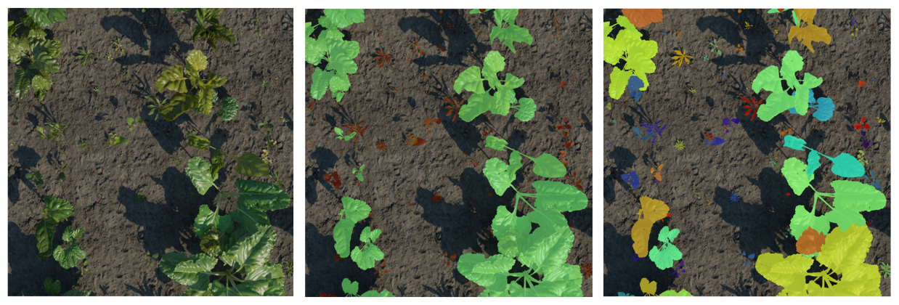

# SugarbeetsSynthetic2025
This is the official Dataset Repository for SugarbeetsSynthetic2025. 

## Dataset Description

The dataset contains 5000 images of sugarbeets and weeds rendered procedurally using Blender based framework (xxxx)




## Dataset Structure
```
<directory_root>
├── coco_annotations
|  └── instances_train.json
├── main_camera
|  └── intrinsics
|  └── extrinsics
|  └── rect
|      └── 0000.png
|      └── 0001.png
|      └── ...
|      └── 4999.png
└── main_camera_annotations
|  └── bounding_boxes
|      └── 0000.txt
|      └── 0001.txt
|      └── ...
|      └── 4999.txt
|  └── semantics
|      └── 0000.png
|      └── 0001.png
|      └── ...
|      └── 4999.png
|  └── semantic_segmentation
|      └── 0000.npz
|      └── 0001.npz
|      └── ...
|      └── 4999.npz
|  └── instance_segmentation
|      └── 0000.npz
|      └── 0001.npz
|      └── ...
|      └── 4999.npz
| config.yaml
| class_id_mapping.yaml
| asset_catalog.yaml
```
The dataset can be downloaded at the following [download link](https://drive.google.com/drive/folders/1-h5F9aat0Y0VmGvgLx13C8A5ZMWCYljJ?usp=drive_link).

## License

The dataset is released under the Creative Commons Attribution-ShareAlike 4.0 International License. See the LICENSE file for more details.

## Citation

If you use this dataset in your research, please cite the following paper:

```
@article{xxxx,
  title={SugarbeetSynthetic2025: Synthetic Data in Agricultural Robotics
for Rapid, Low-Cost Prototyping},
  author={xxxx},
  journal={xxxx},
  year={2025}
}
```
